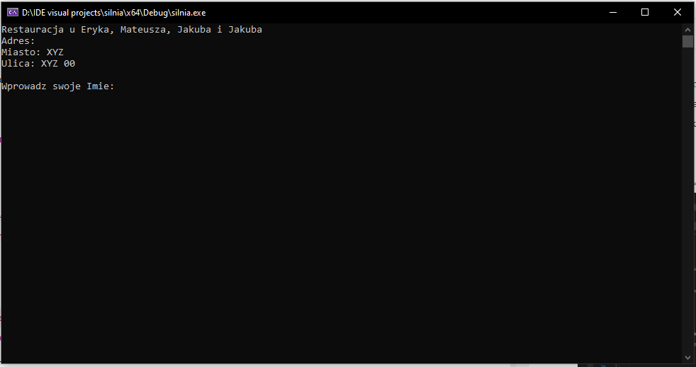
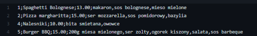

## O aplikacji

Aplikację służy do składania zamówień i rezerwacji miejsc w restauracji.

## Wymagania

-   System operacyjny: windows
-   Dowolny edytor kodu z możliwością kompilacji kodu C++/ kompilator kodu C++

## Instalacja

1. Otwórz przeglądarkę internetową i przejdź na adres: https://github.com/HiImRussel/ProjektStudia
2. Sklonuj pliki ze zdalnego repozytorium przy pomocy dowolnego narzędzia które to umożliwia lub pobierz pliki z repozytorium.
3. Otwórz główny folder aplikacji przy pomocy dowolnego edytora kodu z możliwością kompilacji kodu C++.
4. Skompiluj kod.
5. Jeśli wszystkie kroki zostały wykonanie poprawnie po skompilowaniu aplikacji użytkownik powinien ujrzeć okno widoczne poniżej:

## Sposób działania aplikacji

-   Użytkownik korzystający z aplikacji na wstępie podaję swoje imię oraz nazwisko i wybiera czy zamówienie ma zostać zrealizowane na miejscu czy na dowóz.
-   W następnym kroku użytkownik proszony jest o wybranie sposobu dostawy. Do wyboru użytkownik posiada dwie opcje:

    -   Jedzenie na miejscu z odpowiadającym indexem 1.
    -   Dowóz jedzenia na wskazany w następnym kroku adres z odpowiadającym indexem 2.

    W celu wybrania sposobu dostawy należy wpisać odpowiedni numer przypisany do poszczególnej metody dostawy i zatwierdzić wybór klawiszem "ENTER"

-   W przypadku zatwierdzenia opcji na miejscu osoba jest proszona o wybranie numeru stolika, a w przypadku opcji dowozu pod wyznaczony adres należ podać adres dostawy oraz preferowaną godzinę z podanego zakresu.
-   W następnej kolejności ukazuje się wybór dań z menu. Użytkownik wybiera danie poprzez wpisanie odpowiedniego indexu przypisanego do dania.
    
-   Po wybraniu dania użytkownik wpisuje ilość porcji, która ma zostać dodana do koszyka.
-   W celu edycji koszyka należy wcisnąć klawisz "+" i zatwierdzić klawiszem "ENTER".
    
-   Aby usunąć danie z koszyka należy wprowadzić odpowiadający temu daniu numer znajdujący się po lewej stronie dania.
-   Aby wyjść z edycji koszyka należy wcisnąć klawisz "-" i zatwierdzić klawiszem "ENTER"
-   W celu przejścia do podsumowania zamówienia należy w widoku wyboru dań wcisnąć klawisz "-" i potwierdzić klawiszem "ENTER". Podsumowanie zamówienia zawiera informacje o danych wprowadzone poprzednio przez użytkownika oraz planowany czas przygotowania i końcową cenę.
-   Aby wrócić do składania zamówienia należy wcisnąć klawisz "+" i zatwierdzić wybór klawiszem "ENTER".
-   W celu zakończenia składania zamówienia należy wcisnąć klawisz "-" i zatwierdzić wybór klawiszem "ENTER". Po tej czynności w głównym katalogu aplikacji zostanie wygenerowany rachunek w pliku "rachunek.txt"
    
    

## Modyfikacje

##### Godziny pracy i czas przygotowania

-   W pliku global_varaibles.cpp użytkownik ma możliwość edycji godziny pracy restauracji.

    -   zmienna working_days_from = odpowiada za dni robocze od ustalonej godziny
    -   zmienna working_days_to = odpowiada za dni robocze do ustalonej godziny
    -   zmienna weekend_days_from = odpowiada za weekendy od ustalonej godziny
    -   zmienna weekend_days_to = odpowiada za weekendy do ustalonej godziny

    

-   Na każde danie zostało przepisane 10 minut przygotowania, jednak można to zmienić w pliku global_varaibles.cpp zmieniając wartość making_time_per_dish = ,,10" na dowolną inną liczbę całkowitą.

##### Edycja menu

-   W celu edycji menu należy edytować plik "menu.csv", który znajduje się w głównym katalogu aplikacji.
-   Aby dodać kolejne dania lub edytować już istniejące należy wypełniać następne lub istniejące już wiersze w pliku pamiętając o tym, że każda nowa pozycja w menu musi zaczynać się od nowej linii a poszczególne zestawy danych muszą być oddzielone znakiem ";" (średnik). Plik należy edytować według schematu widocznego poniżej np:
    -   5;nazwa,2.50;składnik1,składnik2

###### Struktura pliku

-   ID -> identyfikator dania, musi być on niepowtarzalną liczbą całkowitą.
-   Nazwa -> nazwa dania
-   Cena -> liczba zmiennoprzecinkowa przecinkowa określająca cenę. Wartość dziesiętna musi zostać oddzielona znakiem "." (kropka)
-   Składniki dania -> składniki dania wypisane po przecinku lub przy pomocy innego separatora oprócz ";"

## Język

Aplikacja została napisana w języku C++.

## Autorzy

Autorami projektu są:

Eryk Bębynek
Mateusz Graś
Jakub Samotyja
Jakub Kozłowski
